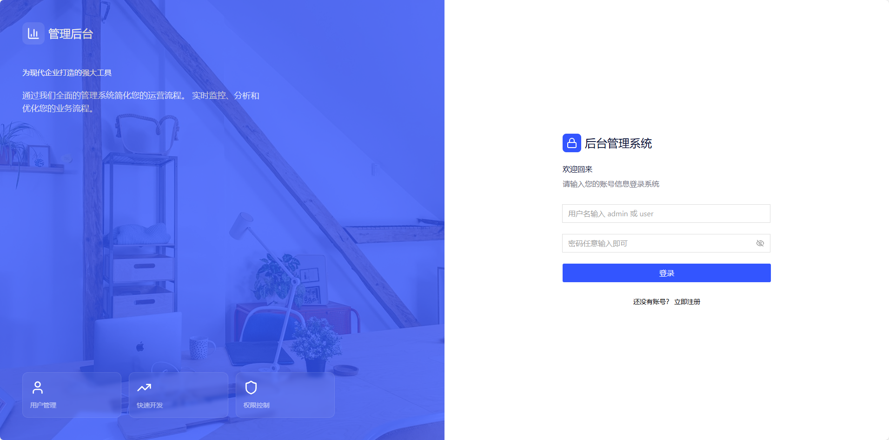
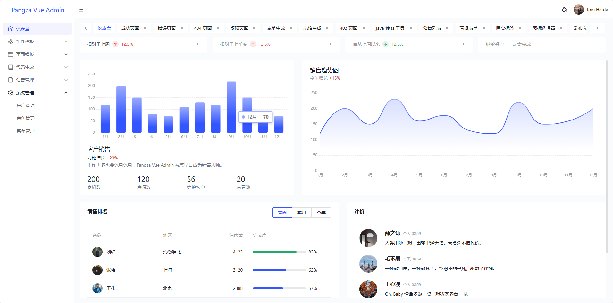
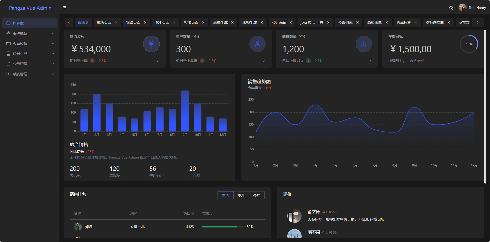
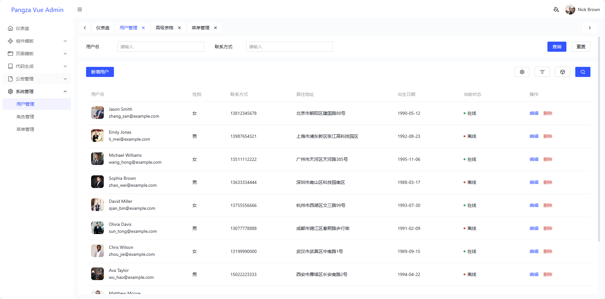
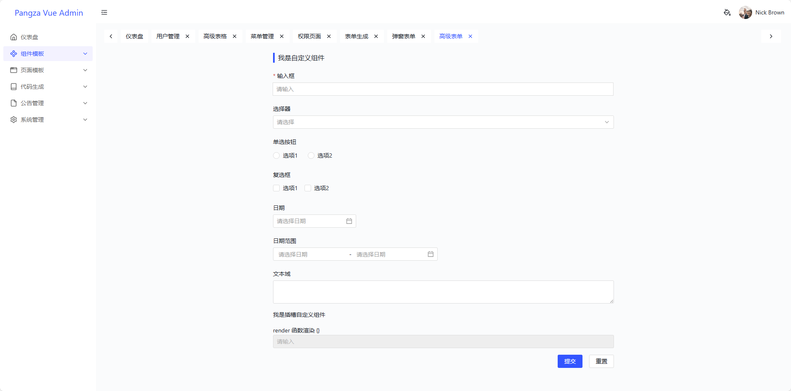

# Pangza Vue Admin

一个基于 Vue 3 + TypeScript 的现代化权限管理系统，提供完整的用户权限控制、主题切换和响应式界面。

## ✨ 特性

- 🚀 **Vue 3 + TypeScript**：采用最新的 Vue 3 组合式 API 和 TypeScript 开发，提供更好的类型安全和开发体验
- 🎨 **TDesign UI 组件库**：使用字节跳动开源的 TDesign Vue Next 组件库，提供丰富的 UI 组件
- 💡 **Tailwind CSS**：集成 Tailwind CSS，实现灵活的样式定制
- 🔒 **完整的权限管理**：支持角色权限控制、动态路由生成
- 🌓 **明暗主题切换**：支持亮色和暗色主题，提升用户体验
- 📱 **响应式设计**：适配各种屏幕尺寸，提供良好的移动端体验
- 🔄 **状态管理**：使用 Pinia 进行状态管理，支持持久化存储

## 📸 项目截图

### 登录



### 亮色主题



### 暗色主题



### 列表



### 表单



## 🛠️ 技术栈

- **框架**：Vue 3.5.18
- **语言**：TypeScript 5.8.3
- **UI 组件库**：TDesign Vue Next 1.15.5
- **样式框架**：Tailwind CSS 3.4.17
- **状态管理**：Pinia 3.0.3
- **路由**：Vue Router 4.5.1
- **构建工具**：Vite 7.1.2

## 📦 安装

### 环境要求

- Node.js >= 22.0.0

### 安装依赖

```bash
npm install
```

## 🚀 快速开始

### 开发环境

```bash
npm run dev
```

启动开发服务器后，访问 `http://localhost:5173` 即可查看项目。

### 构建生产版本

```bash
npm run build
```

构建产物将输出到 `dist` 目录。

### 预览生产构建

```bash
npm run preview
```

## 📁 项目结构

```
src/
├── assets/           # 静态资源
├── components/       # 全局组件
├── config/           # 配置文件
├── hooks/            # 自定义钩子
├── router/           # 路由配置
├── store/            # 状态管理
├── utils/            # 工具函数
├── views/            # 页面组件
├── App.vue           # 应用根组件
└── main.ts           # 应用入口文件
```

## 🎯 主要功能

### 1. 权限管理

- 角色权限控制：支持超级管理员、管理员、普通用户等多种角色
- 动态路由生成：根据用户权限动态加载路由
- 权限切换演示：提供直观的权限切换界面

### 2. 主题系统

- 明暗主题切换：支持亮色和暗色主题
- 自定义主题色：可配置系统主题颜色
- 响应式设计：适配不同屏幕尺寸

### 3. 页面组件

- **登录页面**：提供用户登录功能
- **权限切换页面**：演示不同角色权限的差异
- **404 页面**：优雅的页面不存在提示
- **403 页面**：权限不足提示
- **成功页面**：操作成功反馈
- **错误页面**：操作失败反馈

## 🔧 开发指南

### 组件开发

项目采用 Vue 3 的组合式 API 开发组件，建议按照以下规范：

```vue
<script setup lang='ts'>
// 组件逻辑
</script>

<template>
  <!-- 组件模板 -->
</template>

<style scoped>
/* 组件样式 */
</style>
```
## 📝 许可证

MIT License

## 🤝 贡献

欢迎提交 Issue 和 Pull Request！

---

**Pangza Vue Admin** - 一个现代化的权限管理系统
